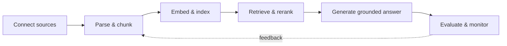

<div align="center">

# ragforge

**Ship RAG you can trust in production.**

An end-to-end platform for retrieval-augmented generation: ingest any source, retrieve with precision,
generate grounded answers, and measure every step.

[](LICENSE)
[](#roadmap)
[](https://github.com/arunk7033/ragforge/stargazers)

[Platform](#platform) · [How it works](#how-it-works) · [Use cases](#use-cases) · [Website](#website) · [Roadmap](#roadmap) · [Contact](#contact)

</div>

---

> [!NOTE]
> ragforge is in early development. The platform features below describe the target design; the [roadmap](#roadmap) shows what is available today.

## Why ragforge?

Most RAG prototypes work in a notebook and fall apart in production: retrieval misses the right context,
answers hallucinate, and nobody can tell when quality regresses. ragforge treats RAG as a system to be
engineered, with reliable retrieval, grounded generation, evaluation, and observability built in from day one.

## Platform

| Capability | What it does |
| --- | --- |
| **Ingestion & chunking** | PDFs, HTML, Markdown, and databases with structure-aware, semantic chunking. |
| **Hybrid retrieval** | Dense and sparse search fused with metadata filters for high recall. |
| **Reranking & generation** | Cross-encoder reranking and citation-grounded prompts across any LLM. |
| **Evaluation suite** | Faithfulness, relevance, and recall metrics with regression gates in CI. |
| **Tracing & observability** | Every query traced end to end: latency, cost, tokens, and retrieved context. |
| **Built to scale** | Async workers, caching, and horizontal scaling for production traffic. |

## How it works

A transparent, six-stage pipeline. Swap any component without rewriting the rest.



1. **Connect your sources**: file stores, databases, or web content, with incremental sync and change detection.
2. **Parse & chunk**: layout-aware parsing keeps tables, headings, and code blocks intact.
3. **Embed & index**: embeddings from the model of your choice, plus a sparse keyword index.
4. **Retrieve & rerank**: hybrid search fuses dense and sparse results; a reranker picks the best context.
5. **Generate grounded answers**: prompts enforce citations to retrieved passages.
6. **Evaluate & monitor**: offline eval suites before every release, live tracing after.

<details>
<summary><strong>Planned Python API</strong></summary>

```python
from ragforge import Pipeline

rag = Pipeline(
    sources=["s3://docs/handbook/"],
    retriever="hybrid",
    reranker="cross-encoder",
    llm="gpt-4o",
)

answer = rag.ask("What is our refund policy?")
# answer.text, answer.citations, answer.trace
```

</details>

## Use cases

- **Support copilots**: answer customer questions from help-center articles and past tickets, with verifiable citations.
- **Enterprise knowledge search**: unify wikis, drives, and internal docs behind one grounded assistant that respects permissions.
- **Compliance & legal review**: query contracts and policies with traceable sources and auditable evaluation reports.

**Planned integrations:** OpenAI, Anthropic, Ollama · pgvector, Qdrant, Elasticsearch · OpenTelemetry

## Website

The marketing site lives in [`site/`](site), built with [Astro](https://astro.build) and [Tailwind CSS](https://tailwindcss.com) as a fully static site.
Its "Log in" button opens the web app.

```bash
cd site
npm install
npm run dev     # http://localhost:4321
npm run build   # static output in site/dist, deployable to Vercel, Netlify, or GitHub Pages
```

All site settings (links, tagline, contact email) live in [`site/src/data/site.ts`](site/src/data/site.ts).
Set `PUBLIC_APP_URL` at build time to point the login button at the deployed web app (defaults to `http://localhost:3000`).

## Web app

The signed-in app lives in [`web/`](web), built with [Next.js](https://nextjs.org) and [Supabase](https://supabase.com) Auth.

| Page | Path | Description |
| --- | --- | --- |
| Log in | `/login` | "Continue with Google" via Supabase OAuth. |
| Chat | `/chat`, `/chat/[id]` | Sidebar with previous chats (rename, delete), streaming chat window. |

Chat history is stored in Supabase Postgres with row-level security, so users only see their own chats.
Answers are placeholders from the backend until retrieval and generation are built.

### Supabase and Google setup

1. Create a project at [supabase.com](https://supabase.com). From **Project Settings → API**, copy the project URL and publishable (or anon) key.
2. In the **SQL editor**, run [`web/supabase/migrations/20261003000000_chats.sql`](web/supabase/migrations/20261003000000_chats.sql).
3. In [Google Cloud Console](https://console.cloud.google.com/apis/credentials), configure the OAuth consent screen, then create an **OAuth client ID** of type *Web application* with the authorized redirect URI `https://<project-ref>.supabase.co/auth/v1/callback`.
4. In Supabase, open **Authentication → Sign In / Providers → Google**, enable it, and paste the Google client ID and secret.
5. In **Authentication → URL Configuration**, set the site URL to `http://localhost:3000` and add `http://localhost:3000/auth/callback` to the redirect URLs (add your production URL later).

```bash
cd web
cp .env.example .env.local   # fill in the Supabase URL and key
npm install
npm run dev                  # http://localhost:3000
```

## Backend

The API lives in [`backend/`](backend), built with [FastAPI](https://fastapi.tiangolo.com). It verifies Supabase access tokens and
currently returns placeholder responses: no model is called and uploaded files are not stored or processed.

| Method | Path | Description |
| --- | --- | --- |
| `GET` | `/health` | Liveness check. |
| `GET` | `/v1/me` | Current user, upload limits, and usage. |
| `POST` | `/v1/chat/stream` | Streams a placeholder assistant reply as plain text. |
| `GET` / `POST` | `/v1/documents` | List or upload documents (max 3 files, 15 MB combined; metadata kept in memory). |
| `DELETE` | `/v1/documents/{id}` | Remove a document. |

```bash
cd backend
cp .env.example .env         # set SUPABASE_URL
uv sync
uv run uvicorn app.main:app --reload --env-file .env   # http://localhost:8000/docs
uv run pytest
```

## Project structure

```text
ragforge/
├── site/                  # Landing page (Astro + Tailwind, static)
│   └── src/
│       ├── components/    # Page sections and UI components
│       ├── data/site.ts   # Site-wide configuration
│       └── pages/         # index.astro
├── web/                   # Signed-in app (Next.js + Supabase)
│   ├── src/app/           # login, auth callback, chat pages, /api/chat
│   ├── src/components/    # Sidebar, ChatView
│   └── supabase/          # SQL migrations
├── backend/               # API (FastAPI)
│   ├── app/routers/       # chat, documents, me
│   └── tests/
├── LICENSE
└── README.md
```

## Roadmap

- [x] Landing page
- [x] Google sign-in (Supabase Auth)
- [x] Chat interface with saved history (placeholder answers)
- [x] API skeleton with token verification (placeholder responses)
- [ ] Ingestion connectors and chunking strategies
- [ ] Hybrid retrieval and reranking
- [ ] Citation-grounded generation
- [ ] Evaluation suite with CI regression gates
- [ ] Tracing and observability dashboard
- [ ] Docker Compose deployment

## Contributing

Ideas, bug reports, and pull requests are welcome. Please open an [issue](https://github.com/arunk7033/ragforge/issues)
first to discuss larger changes.

## Contact

ragforge is created and maintained by [@arunk7033](https://github.com/arunk7033).

- Email: [arunk7033@gmail.com](mailto:arunk7033@gmail.com)
- Issues: [github.com/arunk7033/ragforge/issues](https://github.com/arunk7033/ragforge/issues)

## License

Distributed under the [Apache License 2.0](LICENSE).
